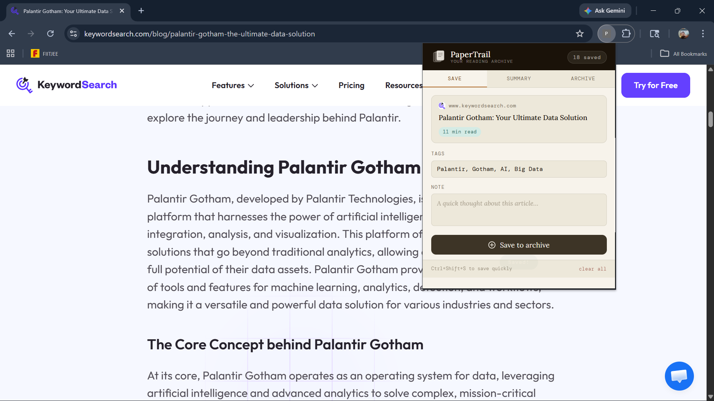
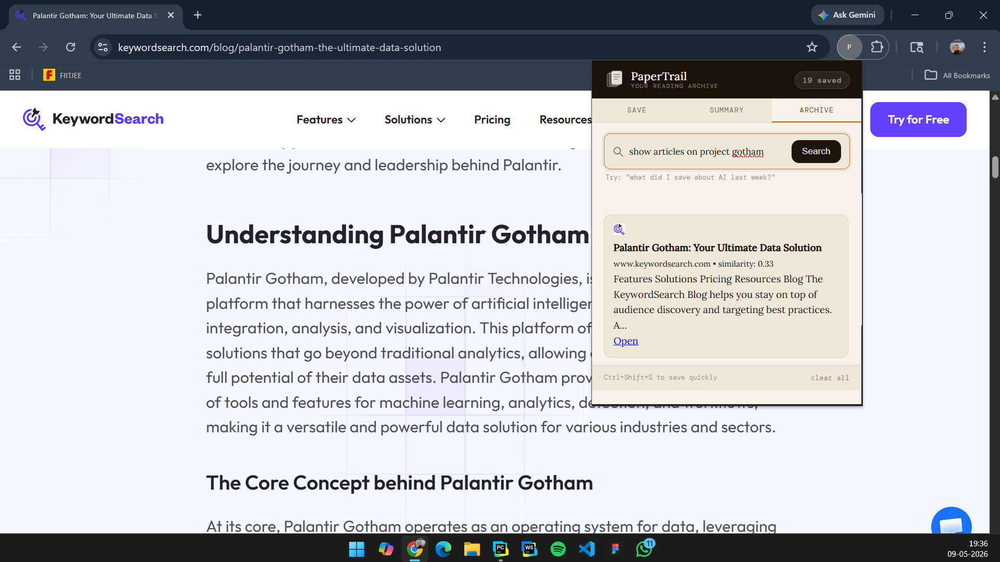
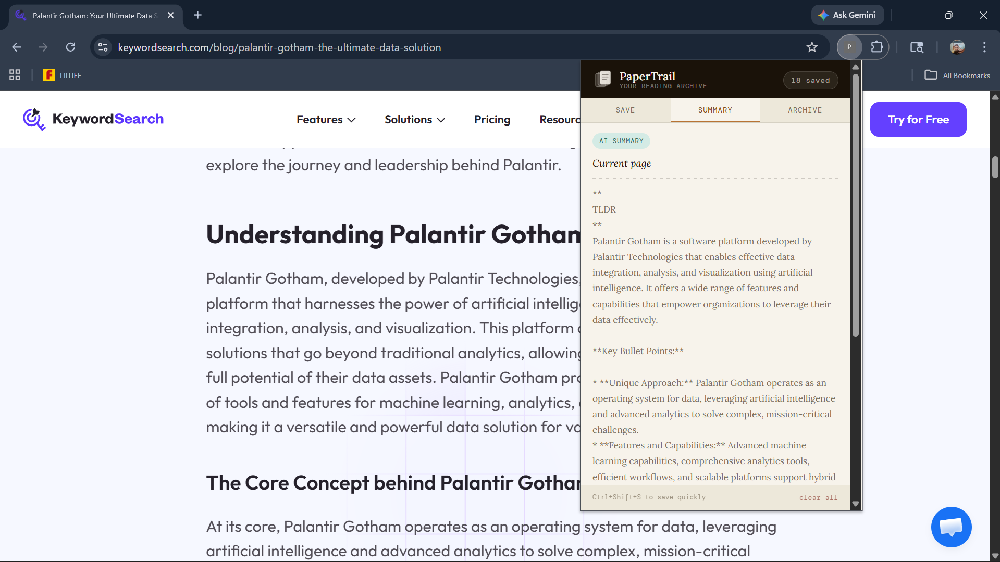

# PaperTrail

*A semantic reading archive for the modern web.*

## Overview

PaperTrail is a Chrome extension that transforms saved articles into a searchable semantic memory system.

Instead of relying on exact keywords, PaperTrail allows users to search their archive using natural human prompts like:

* "that article about Palantir"
* "something I saved on AI agents"
* "the blog about space communication"

The system uses sentence embeddings and cosine similarity to retrieve contextually relevant articles from a personal reading archive.

---

## Features

### Semantic Search

Search articles using natural language instead of exact titles or keywords.

### Intelligent Archiving

Save the current webpage directly from the extension popup.

### Automatic Embeddings

Every saved article is converted into a vector embedding using:

```txt
all-MiniLM-L6-v2
```

### Cosine Similarity Retrieval

Search queries are embedded and compared against stored article vectors.

### Archive Management

* Saved article list
* Favicon rendering
* Read-time estimation
* Tag support
* Semantic search results

### AI Summary Support

Integrated summarization pipeline using Groq.

---

# Architecture

```txt
Chrome Extension
    ↓
Popup UI
    ↓
FastAPI Backend
    ↓
Sentence Transformer Embeddings
    ↓
Cosine Similarity Search
    ↓
Semantic Retrieval Results
```

---

# Tech Stack

## Frontend

* HTML
* CSS
* JavaScript
* Chrome Extension APIs

## Backend

* FastAPI
* Sentence Transformers
* NumPy

## NLP / Semantic Retrieval

* all-MiniLM-L6-v2
* Cosine Similarity
* Vector-based semantic matching

---

# Project Structure

```txt
PaperTrail/
│
├── extension/
│   ├── popup.html
│   ├── popup.js
│   ├── styles.css
│   ├── content.js
│   └── manifest.json
│
├── backend/
│   ├── main.py
│   ├── routes.py
│   └── requirements.txt
│
└── README.md
```

---

# How It Works

## Saving Articles

When a user saves a page:

1. The extension extracts:

   * title
   * URL
   * page text

2. The article is:

   * stored locally in Chrome storage
   * sent to the FastAPI backend

3. The backend:

   * generates embeddings
   * stores vectors in memory

---

## Searching Articles

When a user enters a search query:

1. The query is converted into an embedding.
2. Cosine similarity is computed against saved article vectors.
3. The top semantic matches are returned.
4. Results are rendered in the extension UI.

---

# Installation

## 1. Clone the repository

```bash
git clone <repo-url>
```

---

## 2. Backend Setup

Navigate to backend:

```bash
cd backend
```

Create virtual environment:

```bash
python -m venv .venv
```

Activate:

### Windows

```bash
.venv\Scripts\activate
```

### macOS/Linux

```bash
source .venv/bin/activate
```

Install dependencies:

```bash
pip install -r requirements.txt
```

Run backend:

```bash
uvicorn main:app --reload
```

Backend runs at:

```txt
http://127.0.0.1:8000
```

---

## 3. Load Extension

1. Open Chrome
2. Go to:

```txt
chrome://extensions
```

3. Enable Developer Mode
4. Click:

```txt
Load unpacked
```

5. Select the extension folder

---

# Screenshots

## Save View



---

## Semantic Search



---

## AI Summary



---

# Current Limitations

* Embeddings are stored in memory only
* Search resets when backend restarts
* No authentication yet
* No persistent vector database yet

---

# Future Improvements

* Supabase + pgvector integration
* Persistent vector storage
* User accounts
* Better retrieval ranking
* Hybrid keyword + semantic search
* Timeline memory view
* Cross-device sync
* Agentic reading assistant

---

# Author

Built by Akash Biswal.
